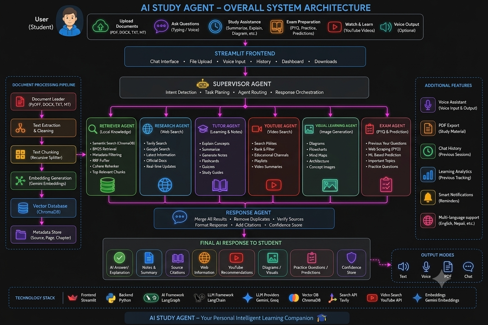

# 📚 AI Study Agent

> ## 🚧 UNDER CONSTRUCTION — NOT PRODUCTION READY 🚧
> **This project is a work in progress.** Core features work, but the app is still being actively debugged, refactored, and stabilized. Expect bugs, incomplete features, and breaking changes without notice. It is **not deployed** and is currently for local development / testing only.
>
> If you're checking this repo out, please don't expect a finished product yet — see [Known Limitations](#known-limitations) below for specifics.

---

An AI-powered study assistant built with **LangGraph** and **Streamlit**. Upload your notes, ask questions, and get answers grounded in your own material — backed up by live web search, YouTube video recommendations, and visual/exam-prep tools when needed.

## Architecture

The app is organized around a **Supervisor Agent** that routes each request to one or more specialized sub-agents, then merges their outputs into a single response.

```
User (Student)
   → Streamlit Frontend (chat, file upload, voice input, history, dashboard, downloads)
      → Supervisor Agent (intent detection, task planning, agent routing, response orchestration)
         → Retriever Agent      – local knowledge (semantic search, BM25, RRF fusion, reranking)
         → Research Agent       – web search (Tavily, Google, official docs, real-time updates)
         → Tutor Agent          – learning & notes (explanations, summaries, flashcards, quizzes)
         → YouTube Agent        – video search (ranking, educational channels, playlists)
         → Visual Learning Agent – diagrams, flowcharts, mind maps, concept images
         → Exam Agent           – PYQ scraping, ML-based prediction, practice questions
      → Response Agent (merge results, dedupe, verify sources, format, add citations, confidence score)
   → Final AI Response (answer, notes, citations, web info, video recs, visuals, practice Qs, confidence score)
      → Output modes: Text · Voice · PDF · Chat
```

### Document Processing Pipeline (feeds the Retriever Agent)
`Document Loader (PyPDF/DOCX/TXT/MD)` → `Text Extraction & Cleaning` → `Text Chunking (recursive splitter)` → `Embedding Generation (Gemini Embeddings)` → `Vector Database (ChromaDB)` → `Metadata Store (source, page, chapter)`

## Features

- **📄 Document Q&A (RAG)** — Upload PDF, DOCX, TXT, CSV, or MD files. The **Retriever Agent** pulls relevant chunks from a persistent Chroma vector store, using semantic search, BM25 retrieval, metadata filtering, RRF fusion, and reranking to ground answers.
- **🌐 Web Search** — The **Research Agent** falls back to Tavily/Google search for current events, recent updates, or anything not covered in uploaded material.
- **🎓 Tutor & Notes** — The **Tutor Agent** explains concepts, summarizes material, and generates flashcards, quizzes, and study guides.
- **▶️ YouTube Recommendations** — The **YouTube Agent** searches, ranks, and filters real educational videos (with thumbnails, channels, playlists, and summaries).
- **🖼️ Visual Learning** — The **Visual Learning Agent** generates diagrams, flowcharts, mind maps, and concept images/architecture visuals.
- **📝 Exam Preparation** — The **Exam Agent** surfaces previous-year questions, scrapes PYQs, predicts likely topics via ML, and generates practice questions.
- **🧩 Response Merging** — The **Response Agent** merges results across agents, removes duplicates, verifies sources, formats the final answer, adds citations, and attaches a confidence score.
- **🧠 Multi-LLM Fallback Chain** — Automatically switches between Groq (Llama 3.3 70B, Qwen 32B) and Gemini if one provider is rate-limited or unavailable, so the agent stays responsive.
- **💬 Persistent Chat Sessions** — Conversation history is checkpointed per session via SQLite, so context isn't lost between turns.
- **🔊 Text-to-Speech** — Listen to responses using Edge TTS, including Nepali voice support.
- **🔎 Transparent Reasoning** — An optional "Show agent steps" view lets users see which agent/tool was used and why.

### Planned Additional Features (per architecture, not yet fully implemented)
- Voice assistant (input & output)
- PDF export of study material
- Learning analytics / progress tracking
- Smart notifications & reminders
- Expanded multi-language support (English, Nepali, and more)

## Tech Stack

**Frontend:** Streamlit
**Backend:** Python
**AI/Agent Framework:** LangGraph, LangChain
**LLM Providers:** Gemini, Groq
**Vector DB:** ChromaDB
**Embeddings:** Gemini Embeddings
**Search API:** Tavily
**Video Search:** YouTube Data API
**TTS:** Edge TTS

## Known Limitations

These are current, real gaps — not hypothetical future concerns:

- **Architecture in progress.** The diagram above reflects the intended multi-agent design; not every agent (e.g. Visual Learning, Exam Agent's ML prediction) is fully wired up or stable yet.
- **No session isolation on documents.** Uploading a file adds it to a shared, persistent vector store. Other sessions may retrieve content you didn't upload yourself.
- **No reliable way to clear the knowledge base** from the UI yet — currently requires manually deleting the `Chroma_db` folder.
- **Rate limits are easy to hit.** The free-tier LLM providers used here (Groq, Gemini) have tight usage limits; heavy testing can trigger errors mid-conversation.
- **Agent/tool selection is inconsistent.** The Supervisor Agent sometimes answers from its own memory instead of routing to the retriever, web search, YouTube, visual, or exam agents as intended.
- **Confidence scores are self-reported by the model**, not independently verified — treat them as a rough signal, not a guarantee.
- **No automated tests** currently cover the graph, agents, or app logic.
- **Not deployed anywhere.** Only runs locally right now.

## Status

This project is actively being developed and **is not finished**. Planned upgrades include:

### Retrieval & Knowledge Base
- Session-scoped document isolation, so one user's uploads don't leak into another session's answers
- A proper "clear knowledge base" control instead of relying on manual vector-store resets
- Support for larger documents and more file types

### Reliability
- Additional LLM fallback providers beyond Groq/Gemini for better uptime
- Retry-with-backoff on transient rate limits before cascading to a fallback provider
- Better handling of token/context limits on longer conversations (auto-trimming chat history)

### Agent Quality
- More consistent Supervisor routing (reducing cases where the agent answers from memory instead of calling the right sub-agent)
- Fully wiring up the Visual Learning Agent (diagrams/flowcharts/mind maps) and Exam Agent (PYQ scraping + ML prediction)
- Improved, more reliable confidence scoring and source attribution
- Better multi-source answer formatting (documents + web + video + visuals combined cleanly)

### UI / UX
- Polished chat interface with clearer agent/tool-usage indicators
- More robust YouTube video card rendering (thumbnails, direct links)
- PDF export and expanded text-to-speech language/voice options
- Learning analytics dashboard and smart notifications

**Deployment is planned** for a future release — the app currently runs locally via Streamlit, with hosted deployment to follow once the above upgrades are complete.

## Running Locally

```bash
streamlit run src/app.py
```

Requires a `.env` file with `GROQ_API`, `TAVILY_API`, `YOUTUBE_API`, and `GOOGLE_API` keys.

## Author

Built by **Aayush Acharya**.

---

> 🚧 **Reminder: this project is still under construction.** Features, structure, and prompts described in this README are subject to change as the project evolves.


